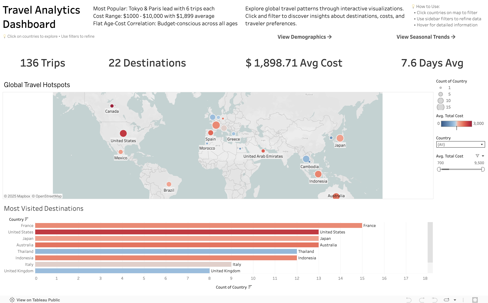
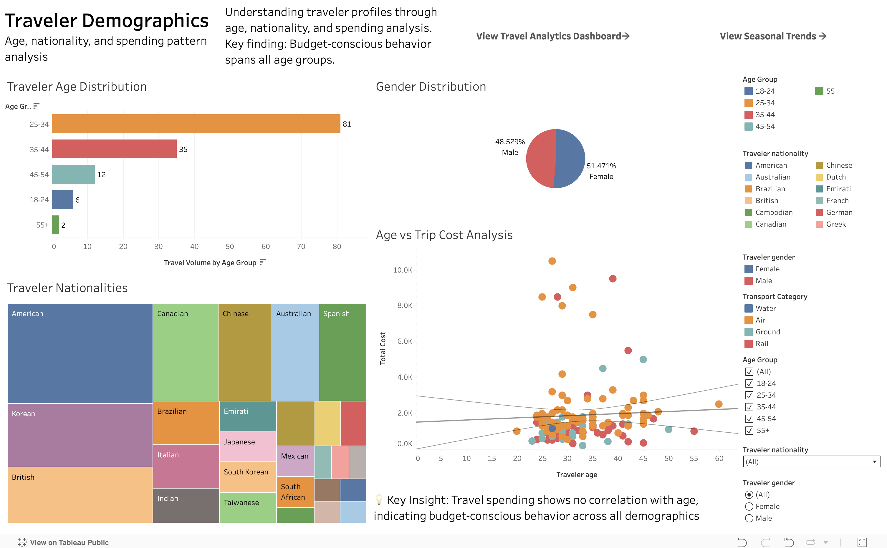
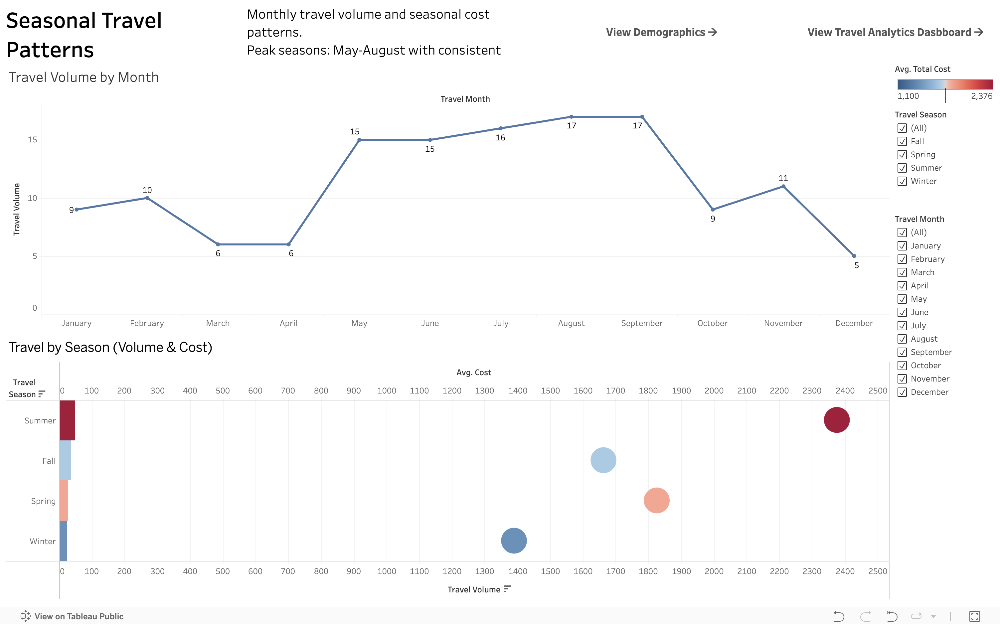

# Travel Analytics Dashboard

Interactive Tableau dashboard analyzing travel patterns from 139 trips across 60+ destinations.



**Live Dashboard**: [View on Tableau Public](https://public.tableau.com/app/profile/anastasia.danopoulou/viz/TravelAnalytics_17582745477190/TravelAnalyticsDashboard)

## 📊 Key Insights
- Most Popular: Tokyo & Paris (6 trips each)
- No age-spending correlation discovered
- Peak travel: May-August months

## 🔗 Additional Views
| Demographics | Seasonal Trends |
|--------------|-----------------|
|  |  |
## 📊 Key Insights
- **Average trip cost**: $1,899
- **Popular destinations**: France, Paris and Japan
- **Traveler demographics**: 33 avg age, global representation
- **Seasonal trends**: Summer peak travel patterns

## 🛠 Quick Start

```bash
# Clean the data
python main.py

# Input: Travel details dataset.csv
# Output: Cleaned travel data.csv (ready for Tableau)
```

## 📈 Dashboard Features
- **Interactive world map** with bubble sizing by trip frequency and color coding by average cost
- **Multi-page navigation** with dedicated views for demographics and seasonal analysis
- **Dynamic cross-filtering** - click countries to filter all visualizations simultaneously
- **Comprehensive demographic analysis** including age distribution, nationality breakdown, and spending patterns
- **Seasonal travel insights** with monthly volume trends and seasonal cost comparisons
- **Key insight discovery** - revealed no correlation between traveler age and trip spending
- **Professional KPI cards** displaying total trips (136), destinations (22), average cost ($1,899), and duration (7.6 days)

## 🧹 Data Cleaning
- **Destination standardization**: "Sydney, AUS" → "Sydney, Australia"
- **Price normalization**: "$1,500 USD" → 1500.0
- **Nationality consistency**: "Brazil" → "Brazilian"
- **Transportation categories**: "Flight/Plane/Airplane" → "Air"

## Key Insights Discovered:
- **No age-spending correlation**: Budget-conscious behavior across all demographics
- **Popular destinations**: France leads with 15 trips, United States, Australia and Japan follows with 13 trips each
- **Seasonal patterns**: Peak travel May-August with 17 trips
- **Global reach**: 22 destinations across 6 continents analyzed


## 📁 Files
- `main.py` - Data processing pipeline
- `cleaning_functions.py` - Data transformation functions  
- `Cleaned travel data.csv` - Tableau-ready dataset

## 🎯 Technologies
**Python** • **Pandas** • **Tableau Public** • **Data Visualization**

## Data Source & License
- **Dataset**: [Traveler Trip Data](https://www.kaggle.com/datasets/rkiattisak/traveler-trip-data)
- **Author**: rkiattisak (Kaggle)

[](https://opensource.org/licenses/MIT)
[](https://creativecommons.org/licenses/by/4.0/)


---
*Portfolio project demonstrating end-to-end data science workflow*